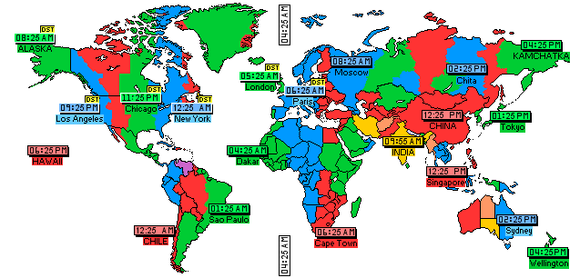

# TimeZone and its use cases

    

## Table of Contents

- [TimeZone and its use cases](#timezone-and-its-use-cases)
  - [Table of Contents](#table-of-contents)
  - [Introduction](#introduction)
  - [Problem statement](#problem-statement)
  - [Common use-case in its brief](#common-use-case-in-its-brief)
  - [Findings](#findings)
  - [Golden rule of thumb](#golden-rule-of-thumb)

---

## Introduction

A time zone is a geographical region where all the clocks are set to the same time. This simplifies timekeeping and avoids confusion when communicating across long distances. There are several different time zone standards, including Coordinated Universal Time (UTC), Greenwich Mean Time (GMT), and International Atomic Time (TAI). If we took a deep look at different standards all of them are interlinked with an offset. For example, UTC+0 is a standard time and reflects midnight but if I want to get the time of Kathmandu then an offset of (+5:45) is added to UTC making it UTC+5:45 which is 5:45 AM. A similar concept applies when changing from one timezone to a different timezone. So what is the problem then?

## Problem statement

As we can see having different timezone creates an unseen complexities when presenting, storing and calculating time. Timekeeping and presentation in a selected timezone would also be difficult when we have two actively interacting workspaces i.e frontend and backend. Moreover it increases complexities when we have users from different nation following different timezone. Situations where dates needs to be formatted between different formats is also a next possible problem. There are concepts which collides when we dig deeper thus a classification of common upcases has been created.

## Common use-case in its brief

1. [**Use case 1:**](./src/Usecase1/ReadMe.md) Date time conversion between different timezones ✅

    We might bump into a situation where we need to convert time from one time zone to another timezone.

2. [**Use case 2:**](./src/Usecase2/ReadMe.md) Date conversion between different formats ✅

    There are several formats of representing time which could vary according to user preferences.

3. [**Use case 3:**](./src/Usecase3/ReadMe.md) Date time calculations to get the difference in time; with/without timezone ✅

    We might come across a situation where we need to find differences between the time which might be stored in different formats and could include or exclude timezones.

4. [**Use case 4:**](./src/Usecase4/ReadMe.md) Storing time-related data in the database and backend data consumption ✅

    We might encounter a situation where the front end needs to send date-time data to the backend and handle operations accordingly.

5. [**Use case 5:**](./src/Usecase5/ReadMe.md) Displaying date time data based on local ✅

    There might be situations when we need to store time in UTC and display it based on the user’s location.

6. [**Use case 6:**](./src/Usecase6/ReadMe.md) Handling date time in different rendering paradigms

    Situations when stored time is consumed on the front end using different rendering paradigms and creating issues due to changes in date-time value.

7. [**Use case 7:**](./src/Usecase7/ReadMe.md) Handling recurring dates and events ✅

    Situations where we need to keep track of recurring events at different timezone.

## Findings

TBD

## Golden rule of thumb

TBD
